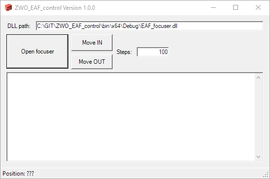

# ZWO_EAF_control

Small to to control the ASI ZWO EAF (Electronic Automatic Focuser)

The ASI ZWO EAF is an autofocus motor used in astronomy to focus the camera or eyepiece.
As there is no easy stand-alone software to connect and control the focuser via PC I wrote this small tool.

You can connect the focuser (or even check if it is connected), read the current firmware version, position and temperatur.
It is also possible to move the focuser by a certain amount.

You are welcome to leave a comment or a change request - have fun!
